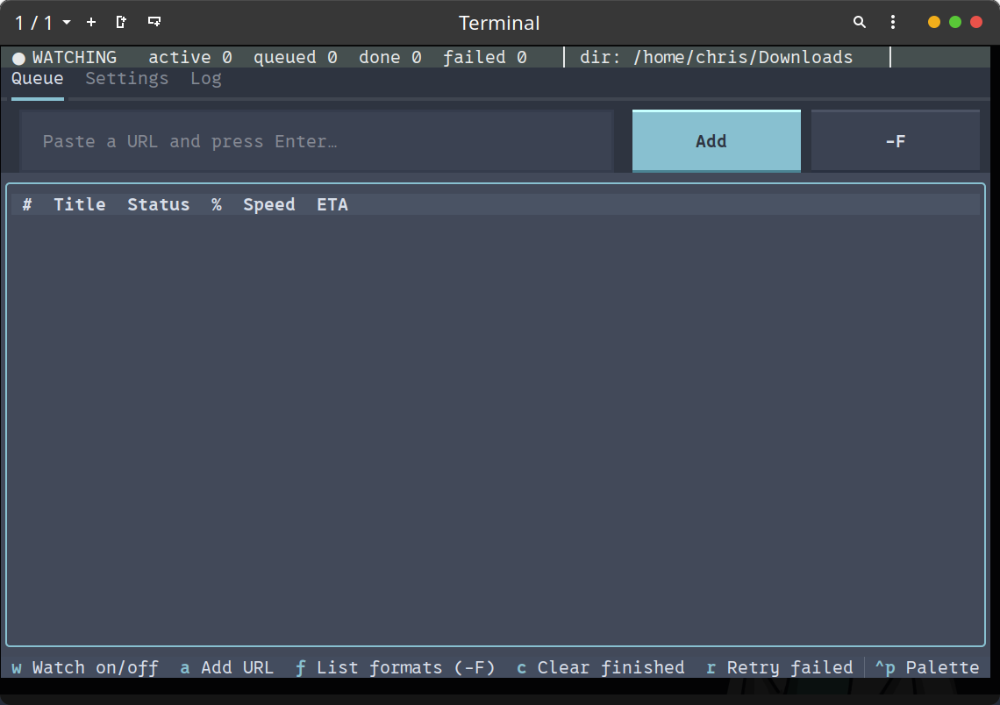
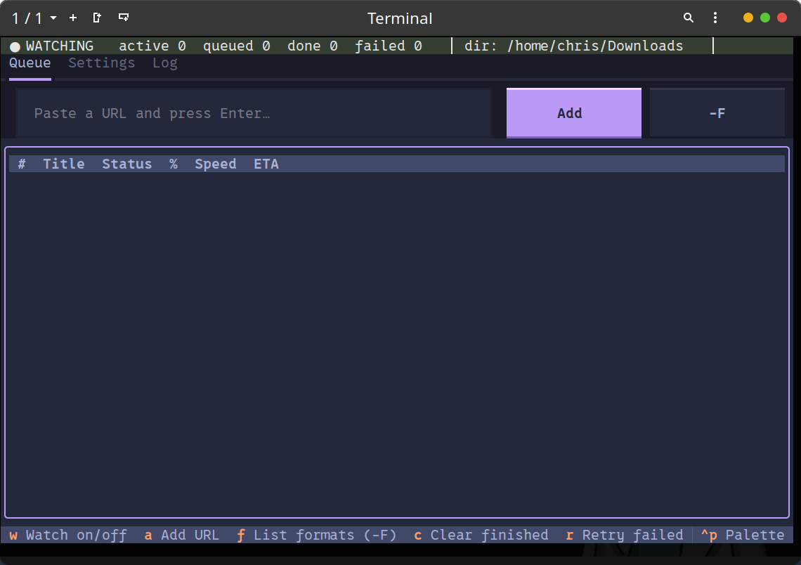
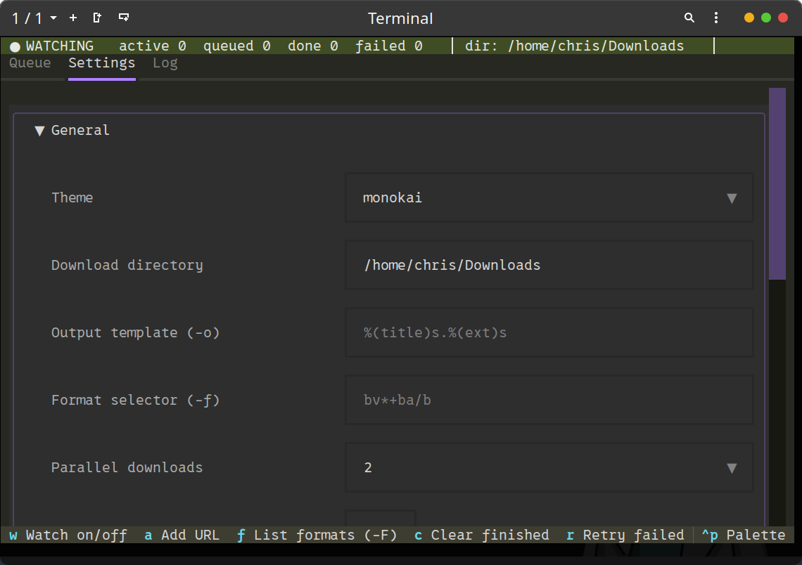
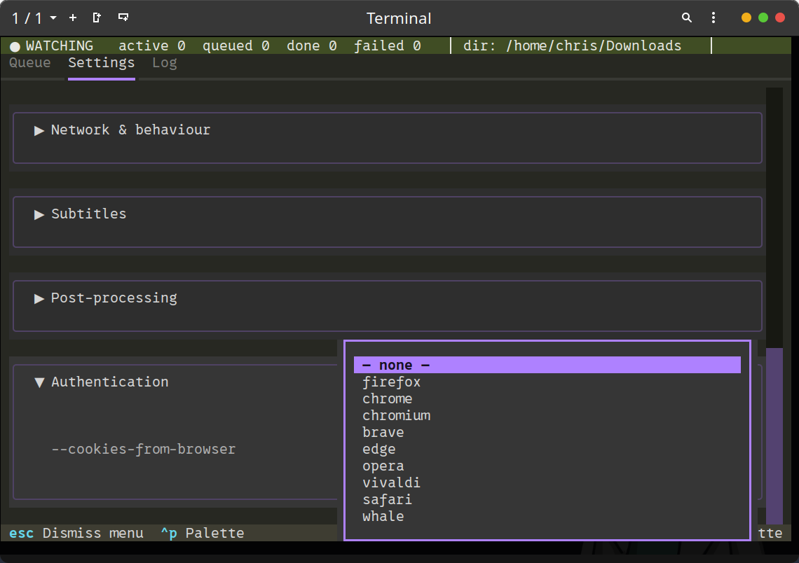

# HawkTUI  
[](https://github.com/theelderemo/hawktui/actions/workflows/release.yml)

<div align="center">
  
</div>

Are you tired of dry, raw, friction-heavy command line interfaces?

Your workflow is exhausted. 

You need to lubricate your download pipeline. You need **HawkTUI**.

The terminal UI that watches your clipboard like a hawk and **gives it that hawk tuah** the second you copy a link. Built with Textual, powered by yt-dlp, and horny for good downloads.

## What is HawkTUI?

It sits in the background, aggressively slurping URLs right off your system clipboard, and spits them directly into your `~/Downloads` folder before you even realize what you've done. 

You copy a link? It catches it.  
You want it in the highest quality? It spits it out perfectly formatted.  
You want audio only? It spits that too.  
And more settings than you can shake a... well, you get the idea.

It is fast. It is automated. And it swallows.

<table align="center">
  <tr>
    <td></td>
    <td></td>
  </tr>
  <tr>
    <td></td>
    <td></td>
  </tr>
</table>

Most yt-dlp wrappers are either boring terminal scripts or bloated GUI.  
HawkTUI is the one that actually **spits on that thang**.

## Features

- **Automatic clipboard watching** - Turn on "Watch" mode (`w`) and let HawkTUI lurk in the background. The second your cursor highlights a URL and you hit `Ctrl+C`, HawkTUI catches it on the tongue. It sucks it off the clipboard and immediately starts downloading.
- **Live progress that doesn't suck** - see percent, speed, and ETA without wanting to die
- **Takes Multiple at Once:** Configurable parallel downloads. Whether you want to take them one at a time or handle 8 concurrently, HawkTUI won't judge your bandwidth.
- **Insanely deep settings** - format selection, audio extraction, subtitles, SponsorBlock, cookies-from-browser, remuxing, rate limiting, and other settings. HawkTUI remembers it exactly how you like it with a persistent config.
- **Queue management** - retry failed downloads, clear finished ones, flex on your completed list
- **Hands-on queue control** - grab any row and do what you want with it: cancel it (`x`), yank it out (`d`), copy its URL back to your clipboard (`y`), open it in your browser (`b`), or open the finished file or its folder (`Enter`). Hit `o` to jump straight to your downloads.
- **Pause the whole queue** (`p`) - freeze new downloads without killing the ones already going. Different from `w`, which only toggles clipboard watching.
- **Allow and deny lists** - only swallow what you actually want. Restrict or block URLs with regex or plain substring patterns, per-site if you like (only `youtu\.be`, or never anything with `?list=`). Off by default.
- **Download history** - keeps a running `hawktui-history.log` of everything it's swallowed (when, what, where, how big) right in your downloads folder.
- **Notifications** - in-app toasts when something finishes, fails, or the whole queue drains, plus optional desktop notifications so it can tell you even when the terminal's in the background.
- **Professional mode** - one switch swaps all the spicy copy and status labels for neutral wording, for when you're running this on a work machine or taking SFW screenshots.
- **Built-in format listing** (`-F`) without leaving the app
- **Gorgeous themes** - Nord, Catppuccin Mocha, Tokyo Night, Gruvbox (the default, to match the hawk), Dracula, and more. Looks slutty in the best way for the r/unixporn screenshot.

## Installation

HawkTUI likes it when your environment is properly set up. yt-dlp is mandatory, don't be a clown [yt-dlp repo](https://github.com/yt-dlp/yt-dlp#installation)

```bash
# Clone the repo
git clone https://github.com/theelderemo/hawktui.git
cd hawktui
```

```bash
# Virt enviroment
python3 -m venv .venv
source .venv/bin/activate
```

```bash
# Install dependencies
pip install textual pyperclip
```

Too lazy to type all that? There's a `requirements.txt` that'll do the slurping for you:

```bash
pip install -r hawktui/requirements.txt
```

On Linux you'll also want `xclip` or `xsel` so the clipboard watching actually works and doesn't just edge you.

```bash
sudo apt install xclip   # or xsel
```

### Want a standalone binary?

If you don't want to keep a Python environment around just to get your fix, `build.py` will package the whole thing into a single executable with PyInstaller and slip it into `~/.local/bin` so you can call `hawktui` from anywhere.

```bash
cd hawktui
python3 hawktui/build.py
```

It spins up its own throwaway virtual environment, grabs the latest of everything (no pinning, it likes it fresh), builds the binary, and drops it in place. If `~/.local/bin` isn't on your `PATH` yet, it'll tell you exactly what to add.

### Don't want to build it yourself?

Prebuilt binaries for Linux and Windows are attached to every [release](https://github.com/theelderemo/hawktui/releases). Grab the one for your platform:

| Platform | Asset |
| :--- | :--- |
| Linux (x86_64) | `hawktui-linux-x86_64` |
| Windows (x86_64) | `hawktui-windows-x86_64.exe` |

On Linux, make it executable and run it:

```bash
chmod +x hawktui-*
./hawktui-*
```
- **These binaries don't bundle yt-dlp or ffmpeg.** They're still required at runtime. See the install steps above. On Linux you also need `xclip` or `xsel` for clipboard watching.
- **The binaries are unsigned.** Windows SmartScreen may flag it (More info - Run anyway). Signing costs money; this does not.

### macOS users

There's no prebuilt macOS binary, build your own from source, it only takes a minute. Clone the repo (see [Installation](#installation) above), then run:

```bash
cd hawktui
python3 hawktui/build.py
```

This spins up a throwaway virtual environment, builds a standalone `hawktui` with PyInstaller, and drops it into `~/.local/bin` so you can call `hawktui` from anywhere. If `~/.local/bin` isn't on your `PATH`, the script tells you exactly what to add. macOS Gatekeeper won't complain since you built it yourself.

Still need yt-dlp and ffmpeg installed at runtime (`brew install yt-dlp ffmpeg`).

## Usage

Just start copying links. Watch it **hawk tuah** them directly into your downloads folder.

Once you are deep inside the TUI, use these keys to control the rhythm:

| Key | What it does |
| :--- | :--- |
| `w` | Toggle clipboard watching |
| `a` | For when you just want to shove a link in yourself. |
| `f` | Voyeuristically list formats (`-F`) for the current URL |
| `c` | Wipes off the mess once downloads are finished |
| `r` | Retry all the ones that failed. We do not accept a floppy, failed network request. |
| `p` | Pause or resume the whole queue. In-flight downloads keep going, nothing new gets started. Not the same as `w`. |
| `x` | Spit the selected download back out (cancel it mid-thrust) |
| `d` | Remove the selected row entirely (spits it out first if it's still going) |
| `y` | Yank the selected URL back onto your clipboard |
| `b` | Open the selected URL in your browser |
| `Enter` | Open the finished file, or its folder if we don't know the exact path yet |
| `o` | Open your downloads folder |
| `Ctrl+P` | Command palette (for the fancy ones) |
| `q` | Pull out and exit (saves your config like a good girl) |

## Configuration

Everything lives in `~/.config/hawktui/config.toml`.

You can tweak almost every yt-dlp flag from inside the app under the **Settings** tab:

- Download directory
- Output template
- Format selector
- Max parallel downloads
- Professional mode (SFW) for work machines and clean screenshots
- URL allow list (only queue URLs matching these patterns, off if empty)
- URL deny list (never queue URLs matching these patterns, off if empty)
- Save download history to `hawktui-history.log` in your downloads folder
- Notifications (in-app toasts and optional desktop notifications)
- Audio extraction + format
- Subtitles (write, embed, auto-generated)
- SponsorBlock removal
- Cookies from browser
- Rate limits, retries, archive file, filename restrictions...

## Contributing

PRs are welcome. If you're adding features, make sure it still feels like something you'd want to hawk tuah on.

## License

MIT. Do whatever you want with it.  

---

Because sometimes you just gotta **spit on that thang**.

It watches. It waits. And when you copy that link...

**Hawk tuah.**

HawkTUI is simply a frontend wrapper. I am not responsible for what you decide to spit onto your hard drive.